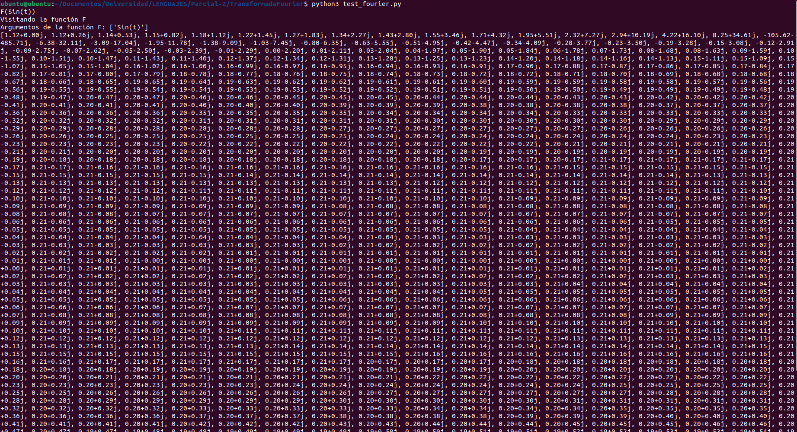
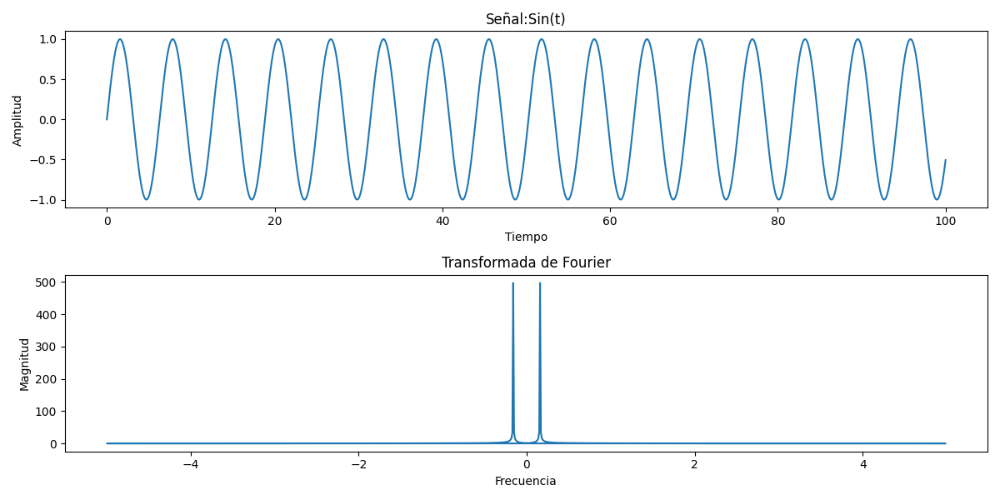
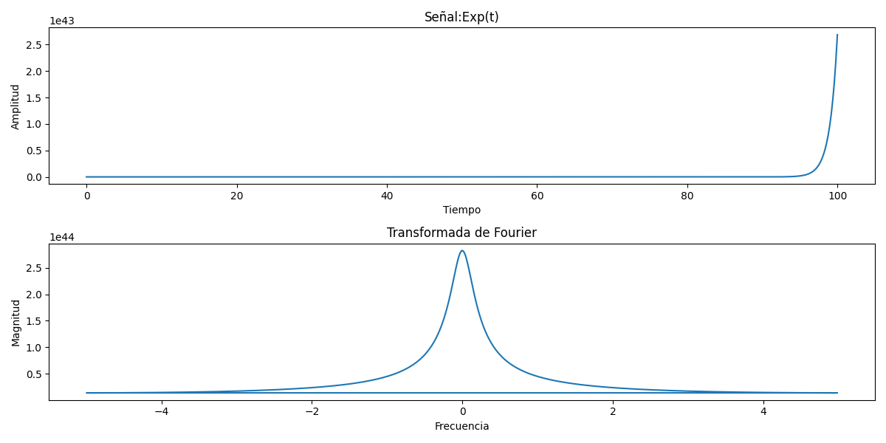
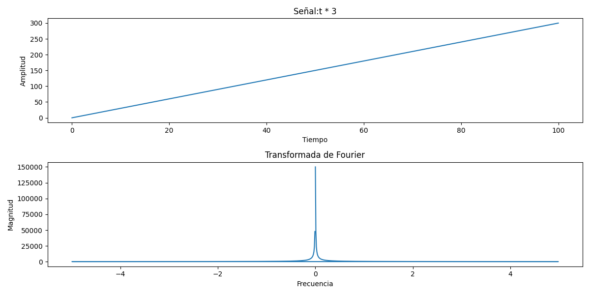

# **Transformada de Fourier**
**Requisitos:** Para ejecutar este proyecto se debe tener instalado Antlr v4.13, Python3, numpy, sympy y matplotlib.

1. Clonar el repositorio con `git clone https://github.com/whocar3s/Parcial-2.git`

2. Desde la consola acceder a la ruta donde se clono el proyecto y a la carpeta `cd TransformadaFourier`

3. Compilar el proyecto con el comando antlr4 -visitor -Dlanguage=Python3 nombredelarchivo.g4

4. Ejecutar el `test_fourier.py` con el comando `python3 test_fourier.py` y escribir la operación a calcular

## **Pruebas**
- Funciones trigonométricas simples:
    ```
    F(Sin(t))
    ```
    - Consola:

    

    - Grafica:

    

- Funciones Exponenciales:
    ```
    F(Exp(t))
    ```
    - Consola:

    

    - Grafica:

    

- Operaciones matemáticas básicas: 
    ```
    F(t * 3)
    ```

    - Consola:

    

    - Grafica:

    

